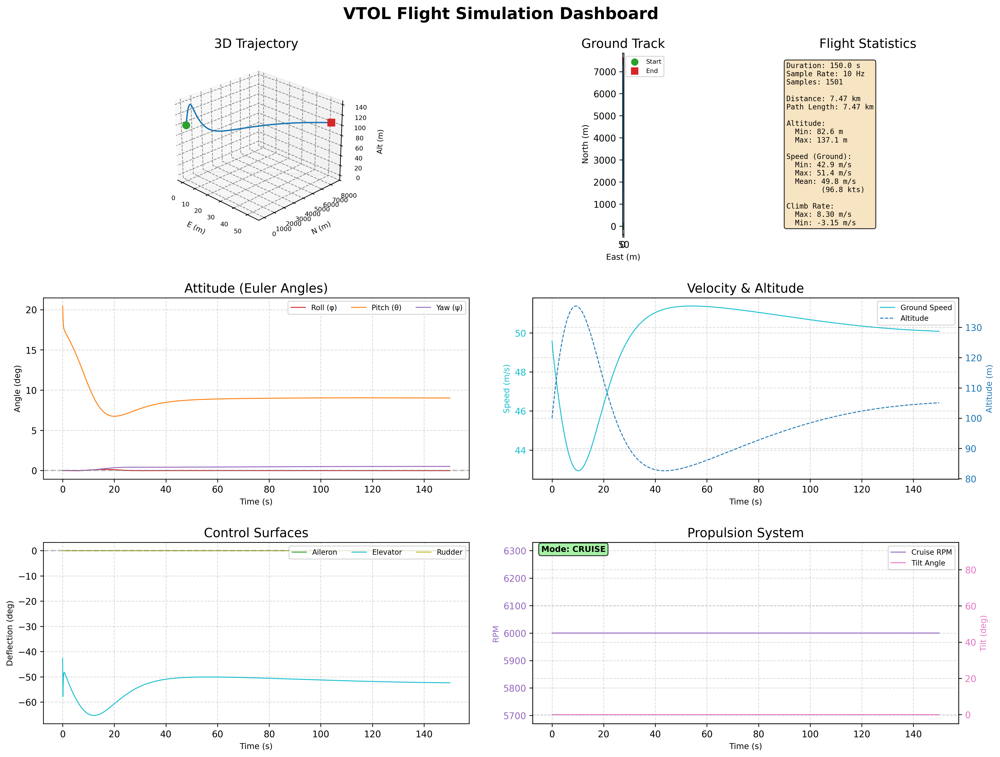

# VTOL Flight Simulation Visualization

[](https://www.python.org/downloads/)
[](https://opensource.org/licenses/MIT)

Professional-grade Python visualization system for VTOL (Vertical Take-Off and Landing) aircraft flight simulation data. Designed to process MATLAB/Simulink simulation outputs and generate publication-quality plots, 3D visualizations, animations, and real-time X-Plane playback.



## Features

- **Data Processing**: Load and validate MATLAB `.mat` simulation files
- **Time History Plots**: Attitude, position, velocity, and control surface histories
- **Trajectory Visualization**: 2D ground tracks and 3D flight paths
- **3D Aircraft Model**: Geometric aircraft representation with attitude visualization
- **Animated Flights**: Generate GIF/MP4 animations of flight trajectories
- **Dashboard View**: Single-page summary with all key flight metrics
- **Configurable Styling**: YAML-based themes for publication-quality output
- **Session Management**: Organize multiple simulation runs cleanly
- **X-Plane Integration**: Real-time flight playback in X-Plane simulator
- **Configurable Mappings**: YAML-based variable mapping for any data format

## Quick Start

### Installation

```bash
# Clone the repository
git clone https://github.com/alireza787b/matlab-xplane-viz.git
cd matlab-xplane-viz

# Create virtual environment
python3 -m venv venv
source venv/bin/activate  # On Windows: venv\Scripts\activate

# Install dependencies
pip install -r requirements.txt
```

### Basic Usage

```bash
# Analyze a session (generates all plots)
python run_analysis.py --session session_001

# Generate plots with animation
python run_analysis.py --session session_001 --animate

# List available sessions
python run_analysis.py --list-sessions

# Analyze a specific MAT file
python run_analysis.py --mat-file path/to/data.mat --output-dir ./output
```

### X-Plane Playback

```bash
# Play flight data in X-Plane
python run_analysis.py --session session_001 --xplane-play

# With speed multiplier
python run_analysis.py --session session_001 --xplane-play --xplane-speed 2.0

# Using standalone script
python scripts/xplane_playback.py path/to/data.mat --speed 1.5 --loop
```

## Project Structure

```
matlab-xplane-viz/
├── config/
│   ├── default.yaml              # Plot styling and colors
│   ├── data_mapping.yaml         # MAT file variable mappings
│   ├── xplane.yaml               # X-Plane connection settings
│   └── aircraft/
│       └── vtol_default.yaml     # Aircraft geometry configuration
├── src/
│   ├── flight_data.py            # Core FlightData class
│   ├── utils/
│   │   ├── conversions.py        # Unit conversions (m/s→knots, rad→deg)
│   │   └── rotations.py          # Rotation matrices, 3D transforms
│   ├── styles/
│   │   └── themes.py             # Plot styling system
│   ├── plotters/
│   │   ├── base.py               # Base plotter class
│   │   ├── time_history.py       # Time series plots
│   │   ├── trajectory.py         # 2D/3D trajectory plots
│   │   ├── controls.py           # Control surface plots
│   │   ├── aircraft_3d.py        # 3D aircraft visualization
│   │   └── dashboard.py          # Summary dashboard
│   └── xplane/                    # X-Plane integration module
│       ├── player.py             # XPlanePlayer class
│       ├── coordinate_utils.py   # NED to Lat/Lon conversion
│       └── backends/             # Communication backends
│           ├── xpc_backend.py    # NASA XPlaneConnect
│           └── udp_backend.py    # Native X-Plane UDP
├── scripts/
│   └── xplane_playback.py        # Standalone X-Plane playback script
├── sessions/                      # Simulation data organized by session
│   └── session_001/
│       ├── raw_data/             # Original .mat files
│       └── plots/                # Generated visualizations
├── docs/                          # Documentation
│   └── guides/
│       ├── getting-started.md    # Getting started guide
│       ├── data-format.md        # Data format specification
│       ├── xplane-setup.md       # X-Plane integration guide
│       └── configuration.md      # Configuration reference
├── requirements.txt
└── run_analysis.py               # Main CLI entry point
```

## Input Data Format

The system expects MATLAB `.mat` files with the following variables (default mapping):

| Variable | Description | Units |
|----------|-------------|-------|
| `N`, `E`, `D` | Position (NED frame) | meters |
| `phi`, `theta`, `psi` | Euler angles (roll, pitch, yaw) | radians |
| `delta_a`, `delta_e`, `delta_r` | Control surfaces (aileron, elevator, rudder) | radians |
| `RPM_Cl`, `RPM_Cr` | Cruise propeller RPM | RPM |
| `theta_Cl`, `theta_Cr` | Propeller tilt angles | degrees |
| `Time` | Simulation duration | seconds |
| `output_hz` | Sample rate | Hz |

**Custom Variable Names:** Edit `config/data_mapping.yaml` to use YOUR variable names:

```yaml
position:
  north: "x_pos"    # Your variable for North position
  east: "y_pos"
  down: "z_pos"
```

See [Data Format Guide](docs/guides/data-format.md) for details.

## Generated Outputs

### Time History Plots
- `attitude.png` - Roll, pitch, yaw angles over time
- `position.png` - North, East, Down positions
- `velocity.png` - Ground speed and climb rate
- `time_history_all.png` - Combined view of all states

### Trajectory Plots
- `ground_track.png` - 2D top-down view
- `trajectory_3d.png` - 3D flight path
- `trajectory_combined.png` - Multiple views combined
- `altitude_profile.png` - Altitude vs time/distance

### Control & Propulsion
- `controls_all.png` - All control inputs
- `control_surfaces.png` - Aileron, elevator, rudder
- `propulsion.png` - RPM and tilt angles

### 3D Visualization
- `aircraft_3d_trajectory.png` - 3D path with aircraft attitude markers

### Summary
- `dashboard.png` - Single-page overview with all key data

### Animations
- `flight_animation.gif` - Animated flight visualization

## Configuration

### Plot Styling (`config/default.yaml`)

```yaml
plot:
  dpi: 300
  format: png
  figure_sizes:
    single: [10, 6]
    dashboard: [16, 12]

colors:
  attitude:
    phi: '#d62728'    # Roll - red
    theta: '#ff7f0e'  # Pitch - orange
    psi: '#9467bd'    # Yaw - purple
```

### Aircraft Geometry (`config/aircraft/vtol_default.yaml`)

```yaml
geometry:
  wing:
    span: 10.0
    chord: 1.5
  propellers:
    cruise:
      positions:
        left: [0.0, -2.5, 0.0]
        right: [0.0, 2.5, 0.0]
```

## CLI Reference

```
usage: run_analysis.py [-h] [--session SESSION] [--mat-file MAT_FILE]
                       [--output-dir OUTPUT_DIR] [--config CONFIG]
                       [--animate] [--fps FPS] [--list-sessions] [--no-clean]

Options:
  --session, -s       Session name (folder in sessions/)
  --mat-file, -m      Path to MAT file (alternative to --session)
  --output-dir, -o    Output directory (required with --mat-file)
  --config, -c        Path to custom style configuration YAML
  --animate, -a       Generate animated visualization (GIF)
  --fps               Animation frames per second (default: 30)
  --list-sessions     List available sessions and exit
  --no-clean          Keep existing plots (default: clean before regenerating)
```

## Adding New Sessions

1. Create a new session folder:
```bash
mkdir -p sessions/my_new_session/raw_data
```

2. Copy your `.mat` file:
```bash
cp my_simulation.mat sessions/my_new_session/raw_data/
```

3. Generate plots:
```bash
python run_analysis.py --session my_new_session
```

## Python API Usage

```python
from src.flight_data import FlightData
from src.plotters import TimeHistoryPlotter, TrajectoryPlotter
from src.styles.themes import load_style

# Load data
flight_data = FlightData.from_mat_file('path/to/data.mat')

# Print summary
print(flight_data.get_summary())

# Create individual plots
style = load_style()
plotter = TimeHistoryPlotter(flight_data, style, output_dir='./output')
fig = plotter.plot_attitude()
fig.savefig('attitude.png')
```

## X-Plane Integration

Play back flight simulation data in X-Plane with full position, attitude, control surface, and propulsion visualization.

### Backends

| Backend | Plugin Required | Best For |
|---------|-----------------|----------|
| `auto` | Tries both | General use |
| `xpc` | Yes ([XPlaneConnect](https://github.com/nasa/XPlaneConnect)) | Best API |
| `native` | No | No setup |

### Quick Example

```python
from src.xplane import XPlanePlayer

with XPlanePlayer() as player:
    player.load("path/to/data.mat")
    player.play(speed=1.5)
```

See [X-Plane Setup Guide](docs/guides/xplane-setup.md) for complete documentation.

## Documentation

- [Getting Started](docs/guides/getting-started.md) - Installation and first analysis
- [Data Format Guide](docs/guides/data-format.md) - MAT file requirements
- [X-Plane Setup](docs/guides/xplane-setup.md) - X-Plane integration guide
- [Configuration Guide](docs/guides/configuration.md) - All configuration options

## Future Roadmap

- [x] **X-Plane Integration**: Real-time visualization via UDP protocol
- [x] **Flight Replay**: Animate simulation in X-Plane
- [x] **Configurable Data Mapping**: Support any MAT file format
- [ ] **Comparison Tools**: Overlay multiple flights for analysis
- [ ] **KML Export**: Google Earth visualization
- [ ] **Report Generation**: PDF reports with analysis
- [ ] **Real-time Streaming**: Live data visualization

## Requirements

- Python 3.8+
- NumPy, SciPy, Pandas
- Matplotlib, Plotly
- PyYAML
- ImageIO (for animations)

See `requirements.txt` for complete list.

## Contributing

Contributions are welcome! Please feel free to submit a Pull Request.

## Author

**Alireza Ghaderi**
- GitHub: [@alireza787b](https://github.com/alireza787b)
- LinkedIn: [alireza787b](https://linkedin.com/in/alireza787b)

## Acknowledgments

- VTOL simulation data provided by flight dynamics research project
- Inspired by MATLAB/Simulink aerospace visualization tools
- Built for professional flight simulation analysis
